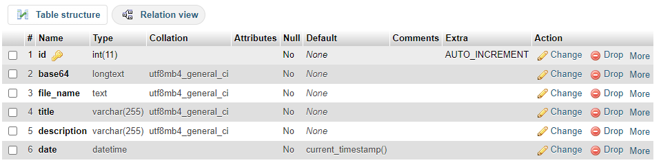

# views

Hello again!! Welcome to my first php project.

---

Thank you for joining me in my coding journey!!

### Description

A web application were people can upload images and save them in their local environment. `views` was made with tailwind, php and mysql.

### Setup

1. Run `npm install` so every dependency in the package.json file installs correctly.
2. Inside http://localhost/dashboard/ go to phpMyAdmin, create a database and create a table named views with the following structure:
   
3. Inside **config/database.php** pass the correct information for every variable.
4. Check the database conection by inspecting index.php inside your browser.A verification string should be logged if everything went ok.

### devDependencies

- @prettier/plugin-php
- prettier

---
